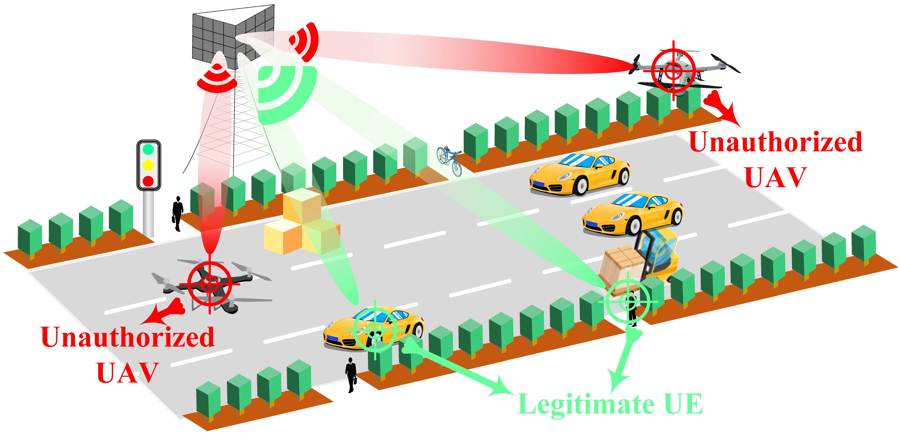

# 2024-IoTJ-CounterUAV

Simulation codes for our paper, titled *Unauthorized UAV Countermeasure for Low-Altitude Economy: Joint Communications and Jamming Based on MIMO Cellular Systems*, which has been accepted by **IEEE IoTJ** and is available on [arXiv](https://arxiv.org/abs/2410.22746) and [IEEE](https://ieeexplore.ieee.org/document/10759668).

For more information, please visit [website](https://gaozhen16.github.io).

## Requirements
- **MATLAB Version:** R2022A
- **CVX Toolbox:** Please download and install CVX from [here](https://cvxr.com/cvx).
