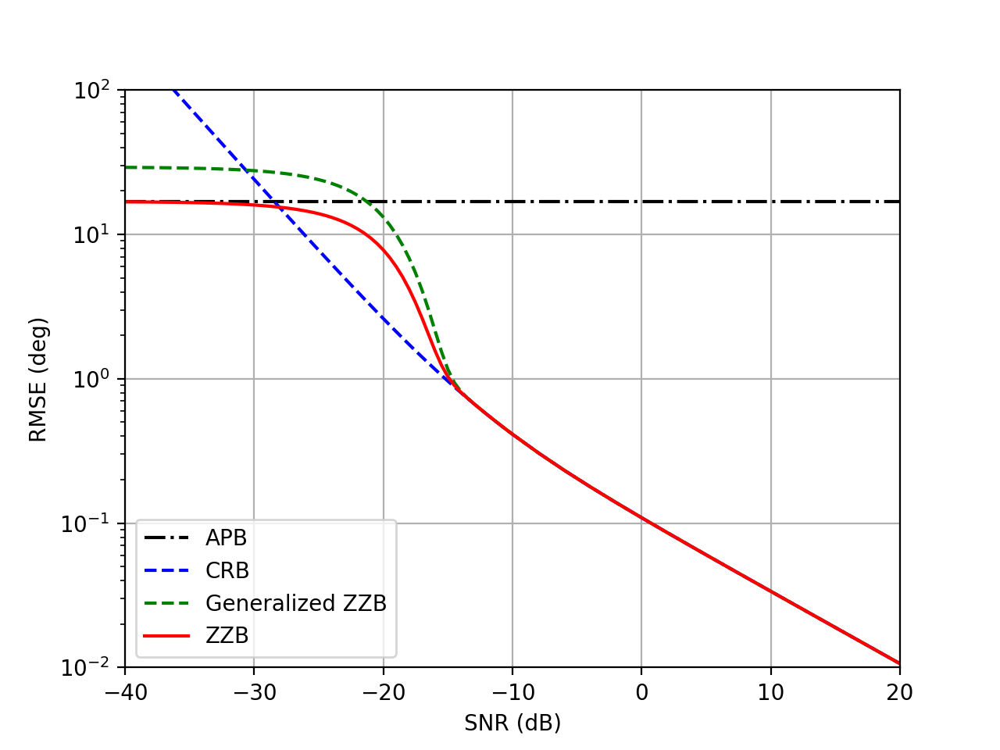

# Ziv-Zakai-Bound-DOAs-Estimation

This repository provides Python codes to plot the performance bounds for multi-source DOA estimation, including a priori bound (APB), Cramer-Rao bound (CRB), and Ziv-Zakai Bound (ZZB). An example plot is shown below.

    

## Reference

Z. Zhang, Z. Shi, and Y. Gu, "Ziv-Zakai bound for DOAs estimation," IEEE Trans. Signal Processing, vol. 71, pp. 136-149, 2023.

The original MATLAB version provided by the authors is available at [this link](https://sites.google.com/view/yujiegu/code).
