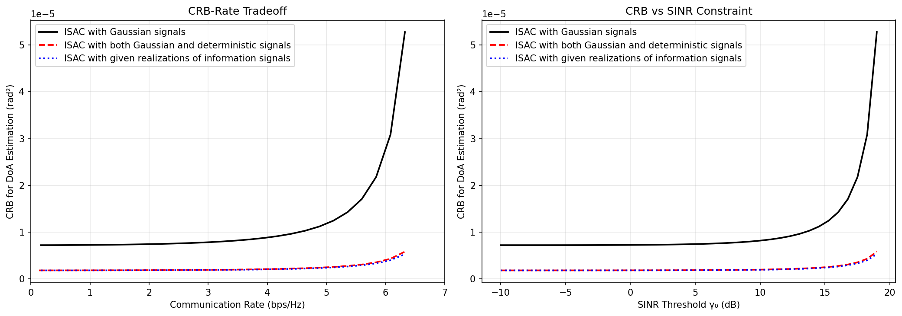

# CRB-Rate Tradeoff for Bistatic ISAC — Reproduction

Reproduction of the paper:

> **"CRB-Rate Tradeoff for Bistatic ISAC With Gaussian Information and Deterministic Sensing Signals"**
> Xianxin Song, **Xianghao Yu**, Jie Xu, Derrick Wing Kwan Ng
> *IEEE Transactions on Wireless Communications*, Vol. 25, 2026

## Overview

This project reproduces the three ISAC (Integrated Sensing and Communication) signal models analyzed in the paper, comparing their CRB-Rate tradeoff curves:

| Case | Description | CRB Formula | Solver |
|:----:|-------------|:-----------:|:------:|
| **1** | Gaussian information signals only | Eq.(22) — with $(1+1/\gamma_{\text{ran}})$ penalty | Closed-form (Proposition 1) |
| **2** | Gaussian info. + deterministic sensing signals | Eq.(45) — weighted sum $A_s + \frac{\gamma_{\text{ran}}}{1+\gamma_{\text{ran}}}A_c$ | SCA (Algorithm 1) |
| **3** | Given realizations of info. signals (benchmark) | Eq.(23) — deterministic CRB, no penalty | Closed-form (Proposition 1) |

## Results

The figure below matches Fig. 5 in the paper:



Key observations (consistent with the paper's Remark 2):
- **Case 1** (Gaussian only): highest CRB due to the $(1+1/\gamma_{\text{ran}})$ penalty — the sensing receiver does not know signal realizations
- **Case 2** (Superposition): much lower CRB — deterministic signals directly improve sensing
- **Case 3** (Given realizations): lowest CRB — serving as the performance upper bound

## Prerequisites

- Python 3.9+
- Packages: `numpy`, `matplotlib`, `cvxpy` (with SCS solver)

```bash
pip install numpy matplotlib cvxpy
```

## Usage

Run each case independently:

```bash
# Case 1: Gaussian signals only
python crb_sim_case1/main.py

# Case 2: Gaussian + deterministic (SCA iterative solver)
python crb_sim_case1/main_case2.py

# Case 3: Given realizations benchmark
python crb_sim_case1/main_case3.py
```

Outputs are saved to `crb_sim_case1/results/`:
- `case1_data.npz`, `case2_data.npz`, `case3_data.npz` — raw data
- `crb_rate_comparison_*.png` — comparison plot

## Project Structure

```
ISAC/
├── .gitignore
├── README.md
└── crb_sim_case1/
    ├── main.py                  # Case 1 entry point
    ├── main_case2.py            # Case 2 entry point (SCA)
    ├── main_case3.py            # Case 3 entry point (benchmark)
    ├── beamforming_opt.py       # Proposition 1 closed-form solver
    ├── case2_solver.py          # SCA algorithm (Algorithm 1)
    ├── crb_calc.py              # CRB formulas (Eq.22, 23, 45)
    ├── comm_rate.py             # Achievable rate (Eq.4, 14)
    ├── channels.py              # Path loss & Rician channel (Eq.62-63)
    ├── steering_vectors.py      # ULA steering vectors (Eq.5, 64)
    ├── plot_results.py          # Plotting utilities
    └── results/                 # Output figures & data
```

## Parameters

All parameters match the paper's **Section V (Numerical Results)**:

| Parameter | Value | Meaning |
|-----------|-------|---------|
| $M_t, M_r$ | 32, 32 | Transmit/receive antennas |
| $T$ | 1024 | Symbol length |
| $P$ | 30 dBm | BS transmit power |
| $\sigma_c^2, \sigma_s^2$ | -80 dBm | Noise power at CU & sensing RX |
| $d_{BT}, d_{TR}$ | 200 m | BS-target & target-RX distance |
| $d_{BC}$ | 1000 m | BS-CU distance |
| $K_0$ | -30 dB | Path loss at 1 m |
| $\alpha_0$ | 2.5 | Path loss exponent |
| $K_c$ | 1.0 | Rician factor |
| $\beta$ | 1.0 | Target reflection coefficient |

## Reproducibility

Random seed is fixed (`h_seed = 46`) for deterministic results. The CAL factor for the target channel coefficient is calibrated to $1.0 \times 10^{-32}$ to match the paper's CRB scale.

## License

This project is for academic reproducibility purposes.
