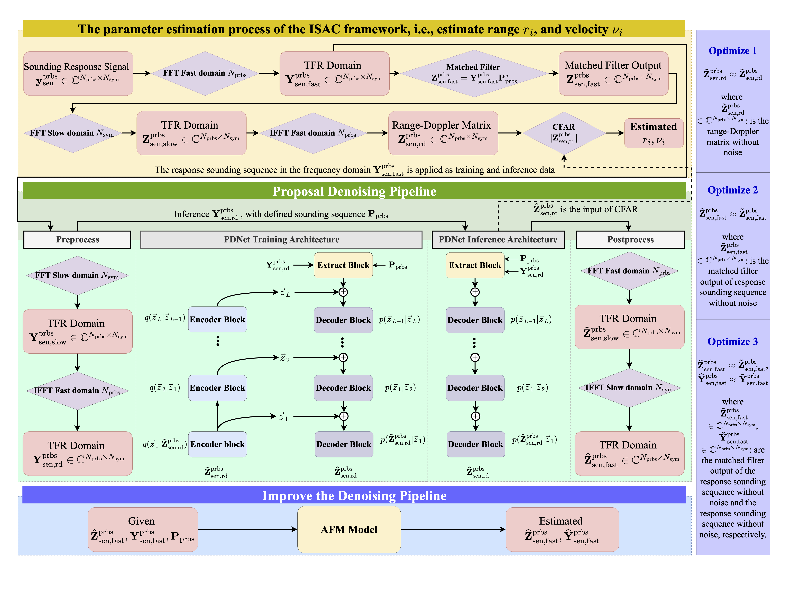

# Probabilistic Denoising-Enhanced and Parameterized Waveform Design for ISAC


## Abstract

Integrated sensing and communication (ISAC) systems require carefully designed waveforms that simultaneously satisfy conflicting objectives: high range-Doppler resolution for sensing and high throughput for communication. However, conventional matched filtering relies on fixed waveform parameters, while learning-based ISAC methods lack theoretical performance guarantees. Both exhibit suboptimal performance under imperfect channel conditions and multi-target scenarios. This paper proposes a parameterized waveform design framework enhanced by probabilistic machine learning for ISAC systems. Our approach, termed Probabilistic Denoising ISAC (PDISAC), employs a lightweight probabilistic denoising network (PDNet) that generates high-quality range-Doppler heatmaps through adversarial training in the time-frequency domain. We analyze the impact of waveform sequence length on the sensing-communication trade-off and demonstrate that PDNet enhances target discriminability across varying sequence lengths. We derive closed-form analytical expressions for the Cramér-Rao lower bound (CRLB) and bit error rate (BER) to characterize fundamental performance limits under waveform constraints. Our map-based channel simulations demonstrate that PDISAC efficiently outperforms matched filtering and learning-based methods in terms of the CRLB at low SNR with reliable communication performance.

## Setup

This codebase is implemented in Python and Matlab and has been tested on macOS devices.

* The Matlab code is used to simulate the data and evaluate the parameter estimation.
* The Python code is used to train and test the proposed model as a preprocessing step for parameter estimation.

The system pipeline is described in the figure below.



### Simulation Data

The simulation data focus on the sensing data of the PDISAC waveform. The simulation code is located at

```
matlab/eval/simul/sen_random_data.m
```

The simulated data are saved at `source_dir = "path/to/data"`. The data include response sequences with noise and response sequences without noise.


### Training/Testing PDNet

After simulating the data, we need to change the configuration settings in the `ml/configs` folder. Change `root_dir='path/to/data/mats/freq/'`. Then set up the environment in `ml/config/ml.py`. After that, run:

```
cd ml
export PYTHONPATH=`pwd`
pip install -r requirements.txt
```

We compare the proposed method with another ML-based model (DnCNN). In the PDNet, we expand the experiment with the limit prior knowledge $\mathbf{P}_{\rm prbs}$, and the adversarial training process. Depending on the settings in `ml/config/ml.py`, we can run the training and testing processes as follows:

```
# Training DnCNN model: no AFM, no sounding
python scripts/train/train_dncnn_y.py

# Training DnCNN model: AFM, no sounding
python scripts/train/train_dncnn_y_afm.py

# Training DnCNN model: no AFM, sounding
python scripts/train/train_dncnn_ys.py

# Training DnCNN model: AFM, sounding
python scripts/train/train_dncnn_ys_afm.py

# Training PDNet model: no AFM, no sounding
python scripts/train/train_pdnet_y.py

# Training PDNet model: AFM, no sounding
python scripts/train/train_pdnet_y_afm.py

# Training PDNet model: no AFM, sounding
python scripts/train/train_pdnet_ys.py

# Training PDNet model: AFM, sounding
python scripts/train/train_pdnet_ys_afm.py

# Test DnCNN/PDNet model: no sounding
python scripts/test/test_y.py

# Test DnCNN/PDNet model: sounding
python scripts/test/test_ys.py
```

After testing, we can run:

```
# Visualize the distribution of the denoising process
python scripts/vis_dis.py

# Visualize the RD heatmap of the data
python scripts/vis_rd.py
```

### Evaluation Parameter Estimation


We set up `matlab/eval/senest/` to estimate the range and velocity of the targets. Then go to `matlab/eval/visual` to visualize the evaluation results:

```
# Comparison of the CRLB of the proposed method
vis_crlb.m 

# Comparison of the NMSE of the proposed method
vis_nmse.m 

# Comparison of the MSE of the proposed method
vis_nmse.m 

# Comparison of the impact of sequence length of PDISAC waveform 
vis_seq_length_impact.m 
```

### Evaluation Data Transmission

The data transmission is evaluated based on the BER and Capacity. At `matlab/eval/visual`, we run

```
# Evaluate the BER performance 
vis_ber.m 

# Visualize the BER vs SNR vs Distance of UE
vis_ber_distance_snr.m

# Visualize the Capacity vs SNR vs Distance of UE
vis_capacity_distance_snr.m
```
