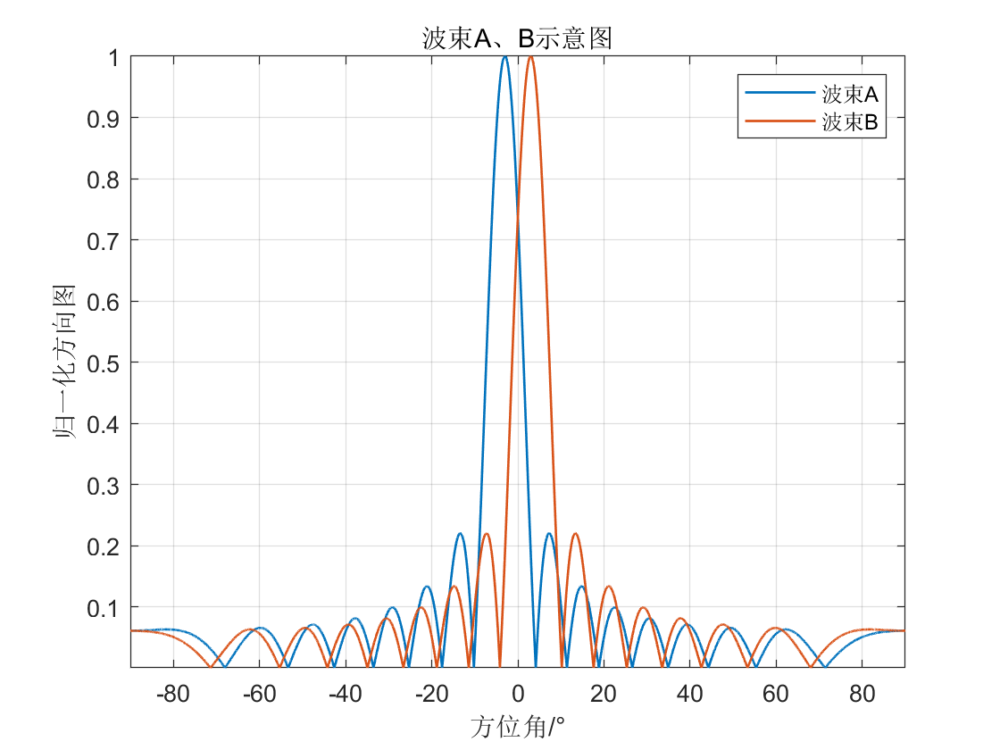

# 雷达测距测速测角——和差波束版本

## 1. 背景介绍

## 2. 仿真系统框图

## 3. 仿真结果
1、首先，我们在与Y轴成-3°、3°的方向进行波束形成，并生成鉴角曲线：

2、在每个PRT都对回波形成波束A、B，得到波束A、B的回波数据；在每个PRT中均使用匹配滤波对波束A、B的回波数据进行压缩；在128个PRT之后，也就是积累到128个脉冲后，进行MTD，检测结果如下（假设nT等于40）：

3、将二维FFT后的结果送入CFAR处理，得到二值掩码矩阵，有目标标记为1，无目标为0。将二值掩码矩阵进行绘图（假设nT等于40）：

4、在nT等于40时，波束A的强度时48353.6，波束B的强度是20383.2，差和比为：(48353.6-20383.2)/ (48353.6+20383.2)= 0.4069。从鉴角曲线当中查找表：可得角度大约在-1.83°，与真实情况的角度(-1.8346°)较为接近:

5、最后所有测量数据存在：

Zk是理论计算值：

误差：

6、航迹模拟：
极坐标下：

放大版·：

XYZ坐标：

## 如果有帮助，点个star吧！